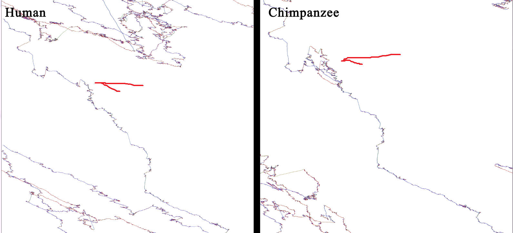

# DIF Introduction

This code is DNA image footprinting and matching. The main idea is to **convert a DNA sequence to an image** to find any related sequences in the image with common algorithms. The goal of the project is to generate a platform like the Google Map service to find, search and match any sequences.

### Sequence comparision
For example, with this footprint, we can compare the sequence of "Human Genome" and "Chimpanzee Genome". As the pictures show, you can find any similarities and dissimilarities in the sequences that are related to this comparison.

### Mutation detection algorithm
The other application is mutation detection. I tested this image footprint for highly mutated sequences and 3 results are shown here:
We can find any highly mutated sequence with a computer vision algorithm.

## The goal application

The goal application could be implemented like the following image. One can see the sequence and the name of that known sequence (yellow lines) and also see the mutated version on other animals (blue line)

## TODO list
- [x] Initial algorithm and demo
- [ ] Generate footprint for common sequences 
- [ ] Convert the footprint to tile image like google map
- [ ] Development of the image processing algorithm
- [ ] A website for comparing and seeing the related sequence like demo
- [ ] Update code for protein seq.

## Limitation 

Now all footprint plots on one image in future releases the tile image will be generated.

# contact with me

[My email](mailto:mahdiks@gmail.com) 

Any suggestions and opinions are welcomed.
